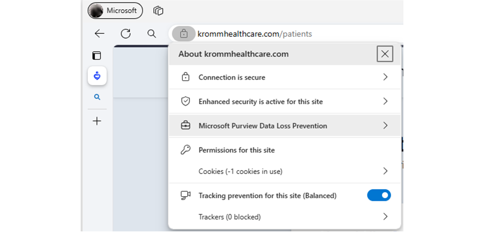

# Understand Data Loss Prevention (DLP) in Microsoft Edge

This article describes how Microsoft Edge supports data loss prevention (DLP) with Endpoint DLP and Windows Information Protection (WIP).

## DLP defined

Data loss prevention (DLP) is a system of technologies that identify and safeguard sensitive enterprise data from unauthorized disclosure. To comply with business standards and industry regulations, organizations must protect sensitive information and prevent its unauthorized disclosure. Sensitive information includes financial data or personal information. Some examples of personal information include credit card numbers, social security numbers, and health records.

Remote work has increased the emphasis on using DLP. With the growing use of personal and work activities on devices, enterprises are seeing an increased risk of unauthorized sharing of corporate data outside the workplace.

This blending of user activities has also spread to devices, where data is moved between personal and corporate devices over various public and private networks. The net result is a dramatically increased risk of exposing sensitive data.

The next screenshot shows the briefcase icon in the lock icon within the address bar, indicating that work-related information is accessed via the browser.

 

Microsoft Edge natively supports two different DLP solutions, Microsoft Endpoint DLP and Windows Information Protection (WIP).

## Microsoft Endpoint data loss prevention (Endpoint DLP)

Microsoft Endpoint DLP is the next generation of data loss prevention using modern concepts such as data-centric protection. It's built-in to Windows 10/11 and Microsoft Edge so it doesn't need more agents or plugins on the device.

> [!NOTE]
> This applies to Microsoft Edge version 85 or later.

To learn more about Endpoint DLP, use the following resources:

- [Video: Microsoft Edge and Data loss prevention (DLP)](microsoft-edge-video-security-dlp.md)
- [Learn about Microsoft 365 Endpoint data loss prevention](/microsoft-365/compliance/endpoint-dlp-learn-about?preserve-view=true&view=o365-worldwide)
- [Get started with Endpoint data loss prevention](/microsoft-365/compliance/endpoint-dlp-getting-started?preserve-view=true&view=o365-worldwide)

Microsoft Edge enforces admin-configured policies for sensitive files, and records audit events for non-compliant activities.

Some of the user activities that you can audit and manage on devices running Windows 10/11 include the following activities:

- File Upload: Protect sensitive file upload to unauthorized cloud locations. <!-- The next 3 screenshots show a sequence where a user tries to drop a sensitive data file on to their local storage.-->
- Clipboard Protection: Protect sensitive data from being copied out of the file.
- Print Protection: Protect sensitive file from being printed.
- Save to USB/Network: Protect sensitive file from being saved to removable USB storage or unauthorized network locations.

For more detailed information about user activities you can audit and manage, see [Endpoint activities you can monitor and take action on](/microsoft-365/compliance/endpoint-dlp-learn-about?preserve-view=true&view=o365-worldwide#endpoint-activities-you-can-monitor-and-take-action-on).

## Windows Information Protection

> [!NOTE]
> Windows information protection will be discontinued over time. For more information, see [Announcing the sunset of Windows Information Protection (WIP)](https://techcommunity.microsoft.com/t5/windows-it-pro-blog/announcing-the-sunset-of-windows-information-protection-wip/ba-p/3579282).

Check out [Support for Windows Information Protection](./microsoft-edge-security-windows-information-protection.md), which describes how Microsoft Edge supports Windows Information Protection (WIP). You can learn more about system requirements, benefits, and supported features in the following sections:

- [System Requirements](./microsoft-edge-security-windows-information-protection.md#system-requirements)
- [Windows Information Protection Benefits](./microsoft-edge-security-windows-information-protection.md#windows-information-protection-benefits)
- [WIP features supported in Microsoft Edge](./microsoft-edge-security-windows-information-protection.md#wip-features-supported-in-microsoft-edge)

## See also

- [Microsoft Edge Enterprise landing page](https://aka.ms/EdgeEnterprise)
- [Video: Data loss prevention - Microsoft Edge](https://www.youtube.com/watch?v=dLD04U9eTqg)
- [Overview of data loss prevention](/microsoft-365/compliance/data-loss-prevention-policies?preserve-view=true&view=o365-worldwide)
- [Protect your enterprise data using Windows Information Protection](/windows/security/information-protection/windows-information-protection/protect-enterprise-data-using-wip)